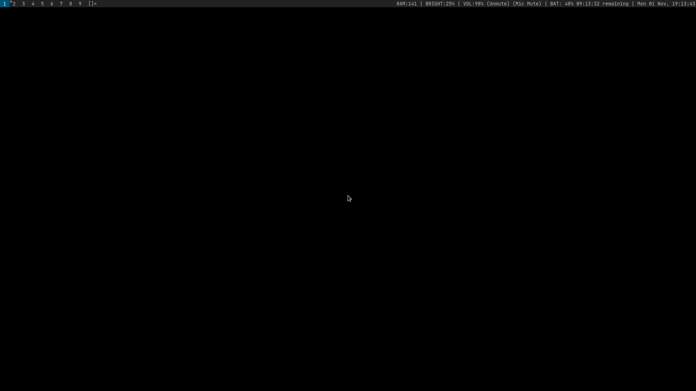
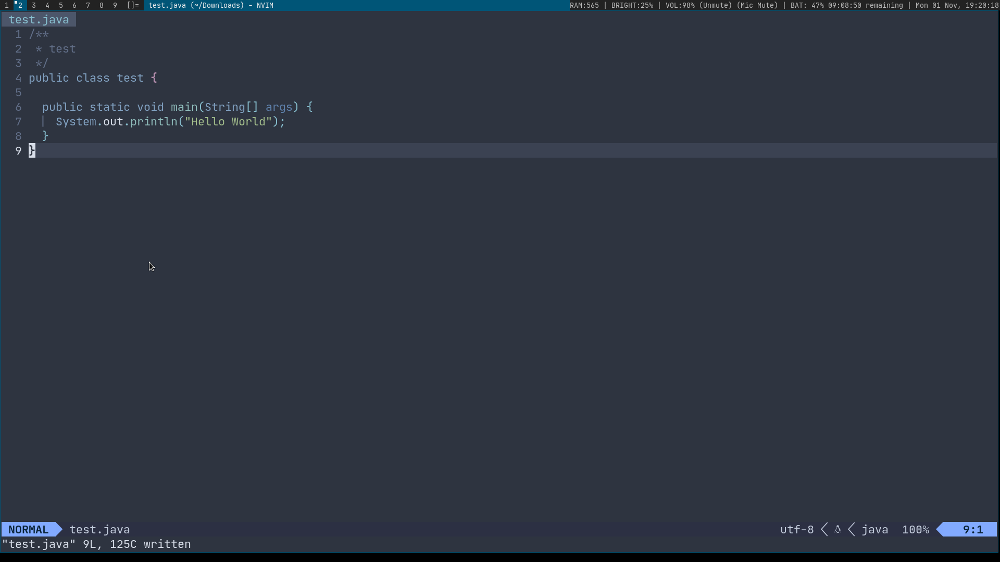

# THIS IS THE CONFIG FILE OF MY MACHINE

## Philosophy
I love suckless'Philosophy, which means I use simple, minimalist and suckless softwares.

## WHAT DOES THIS DOTFILE CONTAIN
This dotfile contains
- Xorg settings
- Bash settings
- Suckless softwares settings and patches
- Neovim config files
- A list of pacman packages which I'm using currently.
- Many more settings, including some services, fcitx5, and qutebrowser.

## DEMO

